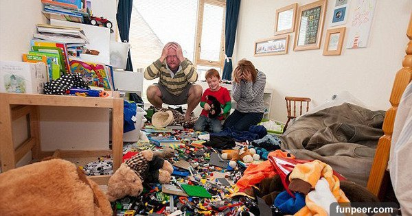

### Get start

This article is the note and thought I get from the conference.

I would mention the following topics:

- type checker for Ruby(steep)
- GC compaction

### type checking for Ruby

#### Ruby 3

Basically, I understand what Matz(creator of Ruby) want is a type inferer generate a type definition file, then we can modify it to be more accurate. Finally, the checker check program based on the file modified by you. So that we can avoid typing any extra information but still have a static type analyzer.

Few questions I have are:

- what if I regenerate the type definition file after I modified it? - seems like would be replaced right now
- how it avoids Hindley Milner type system limit?

      	For example, a mutable cell holding a list of values of unspecified type.
      	p.s. What we can do is [value restriction](http://users.cs.fiu.edu/~smithg/cop4555/valrestr.html) here. Anyway, we need some extension for the type system.

#### [steep](https://github.com/soutaro/steep)

[Video](https://youtu.be/KU1JM4NSKe8)

Then we keep going since I have more talk with Steep creator(Soutaro Matsumoto) XD.

Not going to talk about too many type inference here but I would talk a little bit for the question from Soutaro Matsumoto.

The problem he has is:

```ruby
class Array<T>
  def `[]=`:
    # for arr[1] = T.new
    (Integer, T) -> T
    # for arr[0, 1] = T.new
    | (Integer, Integer, T) -> T
    # for arr[0, 1] = [T.new]
    | (Integer, Integer, Array<T>) -> Array<T>
    # for arr[0..1] = T.new
    | (Range<Integer>, T) -> T
    # for arr[0..1] = [T.new]
    | (Range<Integer>, Array<T>) -> Array<T>
end
```

Now we have a wrong typed example:

```ruby
arr = [1, 2, 3] # Array<Integer>
arr[0] = "foo"
```

From human view, we expect an error like `expected: Integer but got: String`.
However, for overloading, we have to try other methods since we can't sure it would match or not. So the checker keeps going on, and failed at the final definition and report `expected: Array<Integer> but got: String` which is a little bit confusing.

Let's consider more general overloading, at here general means semantic is less limited if the overloading is a normal method than an operator.

```
class C<T>
  def foo:
    (Integer, T) -> T
    | (Integer, Integer, T) -> T
end
```

I think, in this case, we can't do more than say can't find a method for blablabla. For example:

```ruby
c = C<String>.new
c.foo(1, 2)
```

We have no idea user is trying to match `(Integer, Integer, T) -> T` by missing one argument, or trying to type `c.foo(1, "2")` but wrong.

However, in my understanding, we can't add more operators into Ruby by the problem.

So operators actucally are different than normal methods. For example:

```ruby
arr = [1, 2, 3]
arr[0] = 2
arr[0, 2] = 9
```

If `arr[0, 2] =` didn't follow a right hand side expression, it actually represents the same type as `arr[0] = 2` which is obviously wrong. So we can depend on this extra semantic and redefine the type of `[]=` operator to:

```ruby
class Array<T>
  def `[]=`:
    (Integer) -> (T) -> T
    | (Integer, Integer) -> (T) -> T
    | (Integer, Integer) -> (Array<T>) -> Array<T>
    | (Range<Integer>) -> (T) -> T
    | (Range<Integer>) -> (Array<T>) -> Array<T>
end
```

But since we actually don't want the assign missing the right-hand side so we have to have another special notation for this special function, so it could be:

```ruby
class Array<T>
  def `[]=`:
    (Integer) => (T) -> T
    | (Integer, Integer) => (T) -> T
    | (Integer, Integer) => (Array<T>) -> Array<T>
    | (Range<Integer>) => (T) -> T
    | (Range<Integer>) => (Array<T>) -> Array<T>
end
```

`=>` cuts semantic steps. `->` followed by the finally return type.

Which represents:

```ruby
class Array<T>
  def `[]=`:
    [Integer] = T -> T
    | [Integer, Integer] = T -> T
    | [Integer, Integer] = Array<T> -> Array<T>
    | [Range<Integer>] = T -> T
    | [Range<Integer>] = Array<T> -> Array<T>
end
```

p.s. After I mention the idea with Soutaro Matsumoto, he points out the new syntax might not a good idea, that also make sense in the context. Since break current program won't be anyone wants. But in type checker can use the abstraction to do better inference.

### GC compaction

[Video](https://youtu.be/0ypPiULlKfQ)

Why we need compaction? Without compaction, we can have out of memory due to the fragmented heap. What is a fragmented heap?

This is:



After compaction:


Without compaction, we would find there still has enough space but is not contiguous space so can't allocate the object.

#### Two finger compaction

Algorithm use by Lisp. The idea is using two pointers, one move from left to right(ideally) called free, one from right to left called scan, free stops while getting an empty chunk, scan stops while getting a non-empty chunk, when both stop, swap the chunk, end this process until they point to the same chunk, then we update all references.

Cons: Only work with a fixed-size heap -> How to improve it?

#### Pinning Bits

When a pointer in C points to a reference from Ruby, and GC moved the object or delete it, what would happen? We can separate into different conditions:

- moved, in this condition, null reference caused exit
- delete, same as the previous one
- moved and move another object in, in this case, UB would happen, since you might treat an array object as a string object, the behavior is random, this is the craziest condition

To avoid them, we have to tell GC what is hold by C pointer, so in C code not just allocate and free memory also have to write something like `gc_c_mark(pointer_to_ruby_object)` so GC know these objects must be pinned, it can't move them.

#### Allowing movement in C

Following things are related to how to allow movement in C

- compaction callback

      	GC calls the C callback function after compaction is done, give C a chance to update its reference.

- No Pin marking

      	use no pin function for reference object, so GC can manage the object.

- new location function

      	`rb_gc_location` would return the new location of the object.

#### Known issue

```
Ruby Object             C Object
    |                      |
    |                      |
    \---> Third Object <---/
```

Ruby automatically marked some object(gc_mark_no_pin), and not mark from C.

So when compacter run, GC would move the Third Object however C still reference to old place so program explode.

#### Debugging GC

1. Maximum Chaos: doubling Heap
2. Zombie Objects: let some slots can't be GC, always use a zombie object fill it
3. Address Sanitizer: https://github.com/google/sanitizers/wiki/AddressSanitizer

#### More information

- https://bugs.ruby-lang.org/issues/15626
- https://www.ruby-forum.com/t/rb-gc-register-address-or-rb-gc-mark/219828/2
- https://ruby-hacking-guide.github.io/gc.html

### Additional part

For the rest part I don't have enough knowledge to sort out or I didn't take a look or I'm lazy. Here are video links.

- [Automatic Differentiation for Ruby](https://youtu.be/Drxa_DiLV3s)
- [Virtual Machines: their common parts and what makes them special](https://youtu.be/x6FrRQMF5tg)
- [The Journey to One Million](https://youtu.be/Dtn9Uudw4Mo)

### Conculsion

Yes, another Ruby conference I join though I didn't know Ruby :).
