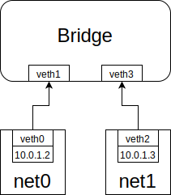
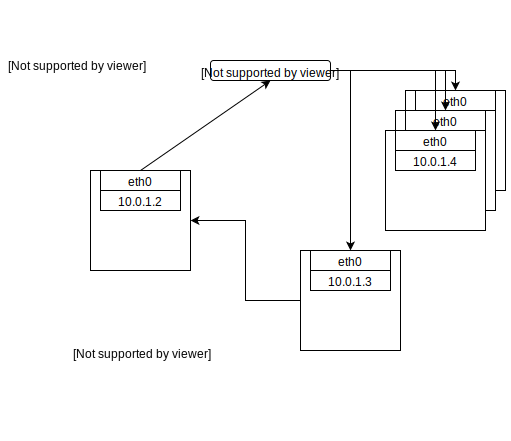
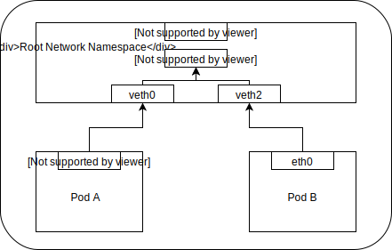
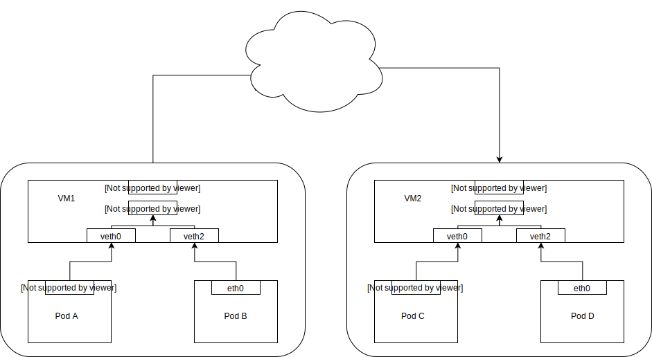
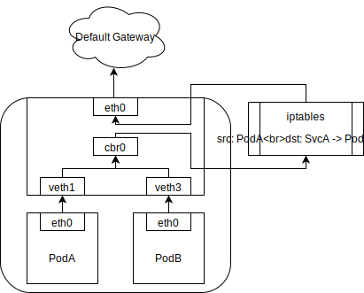

Kubernetes was built to run distributed systems on a cluster of nodes. Understanding the concept of kubernetes networking could help you correctly understanding how to run, monitor and trouble shooting your applications on kubernetes, even more you can know how to choosing the suitable distributed system for yourself by knowing how to comparing them well.

To understand it's networking configuration, we have to start from container and how the operating system provides these resource isolations. We start from `network namespace` this concept of Linux, and create a mock environment for learning how it works as container does. Now, let's begin!

### 1 Network namespace

Before we start, my environment is `Ubuntu 18.04 LTS`, and here is the kernel information:

```bash
$ uname -a
Linux test-linux 4.15.0-1032-gcp #34-Ubuntu SMP Wed May 8 13:02:46 UTC 2019 x86_64 x86_64 x86_64 GNU/Linux
```

#### 1.1 Create new network namespace

```bash
# create network namespace net0
$ ip netns add net0
# create network namespace net1
$ ip netns add net1
# then check
$ ip netns list
net1
net0 (id: 0)
```

Now we have several network namespaces could emit process on it, but the process can't connect to other networks is meaningless. To solve this problem, we have to create a tunnel for them, in Linux, we can use `veth pair` to connect two namespaces directly.

#### 1.2 Create veth pair

```bash
# new veth pair
$ ip link add type veth
# assign veth0 to net0
$ ip link set veth0 netns net0
# assign veth1 to net1
$ ip link set veth1 netns net1
$ ip netns exec net0 ip link set veth0 up
# assign ip 10.0.1.2 to veth0, you can use `ip addr` to check it
$ ip netns exec net0 ip addr add 10.0.1.2/24 dev veth0
$ ip netns exec net1 ip link set veth1 up
# assign ip 10.0.1.3 to veth1
$ ip netns exec net1 ip addr add 10.0.1.3/24 dev veth1
```

> NOTE: An important thing is `veth pair` can't exist alone if you remove one, another would be removed.

Now, `ping` the network namespace `net1` from `net0`

```bash
$ ip netns exec net0 ping 10.0.1.3 -c 3
```

`tcpdump` from target network namespace, of course, you should run `tcpdump` before you `ping` it.

```bash
$ ip netns exec net1 tcpdump -v -n -i veth1
tcpdump: listening on veth1, link-type EN10MB (Ethernet), capture size 262144 bytes
13:54:11.800223 IP6 (hlim 255, next-header ICMPv6 (58) payload length: 16) fe80::905d:ccff:fe4a:cd81 > ff02::2: [icmp6 sum ok] ICMP6, router solicitation, length 16
          source link-address option (1), length 8 (1): 92:5d:cc:4a:cd:81
13:54:12.400440 IP (tos 0x0, ttl 64, id 45855, offset 0, flags [DF], proto ICMP (1), length 84)
    10.0.1.2 > 10.0.1.3: ICMP echo request, id 1433, seq 1, length 64
13:54:12.400464 IP (tos 0x0, ttl 64, id 41348, offset 0, flags [none], proto ICMP (1), length 84)
    10.0.1.3 > 10.0.1.2: ICMP echo reply, id 1433, seq 1, length 64
13:54:13.464163 IP (tos 0x0, ttl 64, id 45912, offset 0, flags [DF], proto ICMP (1), length 84)
    10.0.1.2 > 10.0.1.3: ICMP echo request, id 1433, seq 2, length 64
13:54:13.464189 IP (tos 0x0, ttl 64, id 41712, offset 0, flags [none], proto ICMP (1), length 84)
    10.0.1.3 > 10.0.1.2: ICMP echo reply, id 1433, seq 2, length 64
13:54:14.488184 IP (tos 0x0, ttl 64, id 46671, offset 0, flags [DF], proto ICMP (1), length 84)
    10.0.1.2 > 10.0.1.3: ICMP echo request, id 1433, seq 3, length 64
13:54:14.488221 IP (tos 0x0, ttl 64, id 41738, offset 0, flags [none], proto ICMP (1), length 84)
    10.0.1.3 > 10.0.1.2: ICMP echo reply, id 1433, seq 3, length 64
```

**HTTP** can work also.

**HTTP** server:

```bash
$ ip netns exec net1 python3 -m http.server
Serving HTTP on 0.0.0.0 port 8000 ...
# After you execute the following command here would show
10.0.1.2 - - [15/May/2019 13:55:41] "GET / HTTP/1.1" 200 -
```

**HTTP** client:

```bash
$ ip netns exec net0 curl 10.0.1.3:8000
<!DOCTYPE HTML PUBLIC "-//W3C//DTD HTML 4.01//EN" "http://www.w3.org/TR/html4/strict.dtd">
<html>
<head>
<meta http-equiv="Content-Type" content="text/html; charset=utf-8">
<title>Directory listing for /</title>
</head>
<body>
<h1>Directory listing for /</h1>
<hr>
<ul>
<li><a href=".bash_history">.bash_history</a></li>
<li><a href=".bash_logout">.bash_logout</a></li>
<li><a href=".bashrc">.bashrc</a></li>
<li><a href=".config/">.config/</a></li>
<li><a href=".docker/">.docker/</a></li>
<li><a href=".profile">.profile</a></li>
<li><a href=".theia/">.theia/</a></li>
<li><a href="README-cloudshell.txt">README-cloudshell.txt@</a></li>
</ul>
<hr>
</body>
</html>
```

Although `veth pair` could help you connect two network namespaces, however, it can't work with more. While we are working on an environment with more than two network namespaces, we would need a more powerful technology: Bridge.

#### 1.3 Create a virtual bridge

```bash
# create bridge
$ ip link add br0 type bridge
$ ip link set dev br0 up
# create veth pair for net0, veth0 & veth1
$ ip link add type veth
# create veth pair for net1, veth2 & veth3
$ ip link add type veth
# set up veth pair of net0
$ ip link set dev veth0 netns net0
# You would find veth0 disappeared now by `ip link`
$ ip netns exec net0 ip link set dev veth0 name eth0
$ ip netns exec net0 ip addr add 10.0.1.2/24 dev eth0
$ ip netns exec net0 ip link set dev eth0 up
# bind veth pair of net0 to br0
$ ip link set dev veth1 master br0
$ ip link set dev veth1 up
# set up veth pair of net1
$ ip link set dev veth2 netns net1
$ ip netns exec net1 ip link set dev veth2 name eth0
$ ip netns exec net1 ip addr add 10.0.1.3/24 dev eth0
$ ip netns exec net1 ip link set dev eth0 up
# bind veth pair of net1 to br0
$ ip link set dev veth3 master br0
$ ip link set dev veth3 up
```

Now, ping `10.0.1.3` from `net0` to check our bridge network.

```bash
$ ip netns exec net0 ping 10.0.1.3 -c 3
PING 10.0.1.3 (10.0.1.3) 56(84) bytes of data.
64 bytes from 10.0.1.3: icmp_seq=1 ttl=64 time=0.030 ms
64 bytes from 10.0.1.3: icmp_seq=2 ttl=64 time=0.059 ms
64 bytes from 10.0.1.3: icmp_seq=3 ttl=64 time=0.051 ms

--- 10.0.1.3 ping statistics ---
3 packets transmitted, 3 received, 0% packet loss, time 2038ms
rtt min/avg/max/mdev = 0.030/0.046/0.059/0.014 ms
```

`tcpdump` our bridge: `br0`

```bash
$ tcpdump -v -n -i br0
tcpdump: listening on br0, link-type EN10MB (Ethernet), capture size 262144 bytes
12:43:39.619458 IP (tos 0x0, ttl 64, id 63269, offset 0, flags [DF], proto ICMP (1), length 84)
    10.0.1.2 > 10.0.1.3: ICMP echo request, id 3046, seq 1, length 64
12:43:39.619553 IP (tos 0x0, ttl 64, id 54235, offset 0, flags [none], proto ICMP (1), length 84)
    10.0.1.3 > 10.0.1.2: ICMP echo reply, id 3046, seq 1, length 64
12:43:40.635730 IP (tos 0x0, ttl 64, id 63459, offset 0, flags [DF], proto ICMP (1), length 84)
    10.0.1.2 > 10.0.1.3: ICMP echo request, id 3046, seq 2, length 64
12:43:40.635764 IP (tos 0x0, ttl 64, id 54318, offset 0, flags [none], proto ICMP (1), length 84)
    10.0.1.3 > 10.0.1.2: ICMP echo reply, id 3046, seq 2, length 64
12:43:41.659714 IP (tos 0x0, ttl 64, id 63548, offset 0, flags [DF], proto ICMP (1), length 84)
    10.0.1.2 > 10.0.1.3: ICMP echo request, id 3046, seq 3, length 64
12:43:41.659742 IP (tos 0x0, ttl 64, id 54462, offset 0, flags [none], proto ICMP (1), length 84)
    10.0.1.3 > 10.0.1.2: ICMP echo reply, id 3046, seq 3, length 64
12:43:44.859619 ARP, Ethernet (len 6), IPv4 (len 4), Request who-has 10.0.1.2 tell 10.0.1.3, length 28
12:43:44.859638 ARP, Ethernet (len 6), IPv4 (len 4), Request who-has 10.0.1.3 tell 10.0.1.2, length 28
12:43:44.859686 ARP, Ethernet (len 6), IPv4 (len 4), Reply 10.0.1.2 is-at 0a:e0:a1:07:b7:c9, length 28
12:43:44.859689 ARP, Ethernet (len 6), IPv4 (len 4), Reply 10.0.1.3 is-at d2:b6:de:2f:4e:f6, length 28
```

As you thought, `br0` would get the traffic from `net0` to `net1`, now we have topology looks like:

##### Figure 1.1



At the final of the output of `tcpdump` we can see some ARP request/reply, we would talk about it in the next section.

To get more info:

- [wiki: linux namespace](https://en.wikipedia.org/wiki/Linux_namespaces)

### 2 ARP

ARP(Address Resolution Protocol) is a communication protocol used for discovering the link layer address, such as a MAC address associated with a given internet layer address.

> NOTE: In IPv6(Internet Protocol Version 6), the functionality of ARP provided by NDP(Neighbor Discovery Protocol).

We aren't going to show the whole packet layout of ARP, but mention the part we care in the case.

The working process is:

1. send ARP request packet with source MAC and source IP and target IP to broadcast address
2. the machine thought it has this target IP would send ARP reply packet contains it's MAC address
3. the machine sends ARP request would cache the mapping of IP and MAC into ARP cache, so next time it doesn't have to send ARP request again.

> NOTE: others endpoint would ignore non-interested ARP request

##### Figure 2.1



At the previous section, we can see both sides send ARP request to get another IP's information.

To get more info:

- [RFC 826](https://tools.ietf.org/html/rfc826)
- [wiki: ARP](https://en.wikipedia.org/wiki/Address_Resolution_Protocol)

### 3 Pod to Pod

**Pod** is the unit of kubernetes, so the most basic networking is how to connect from PodA to PodB.
We would get two situation:

1. two **Pod** at the same **Node**
2. two **Pod** at the different **Node**

> **Node** can is a VM or machine which owned by kubernetes cluster.

In the following discussion we are all based on [Kubenet](https://kubernetes.io/docs/concepts/extend-kubernetes/compute-storage-net/network-plugins/#kubenet)
this implementation. **Kubelet** would need to set `--network-plugin=kubenet`.

#### 3.1 Pods at the same Node

In this case, it just as the first section, Pods would connect to the same bridge, in case called: `cbr0`.

> Kubenet creates a Linux bridge named `cbr0` and creates a veth pair for each pod with the host end of each pair connected to `cbr0`.

Since we already talk about this way, we don't spend more time at here, the interesting part is,
how to allow Pods on

##### Figure 3.1 two pods at the same node



#### 3.2 Pods at the different Node

When container networking have to work with other host of container, the problem would show.
At the tranditional environment we do not care the cluster consist of serveral host of container.
In old networking model we thought any container have to connect to outside world must using a host port to do that.
But in cluster world, port is a limited resource which would cause we can't scale the cluster well!
That's why we have [CNM](https://github.com/docker/libnetwork/blob/master/docs/design.md) and [CNI](https://github.com/containernetworking/cni/blob/master/SPEC.md) these models.
We aren't going to discuss their detail, but mention the possible approach of real world networking topology.

Two **Pod** at the different **Node** won't be able to using the same bridge, which means we can't directly let packet pass through between them.

##### Figure 3.2 concept of nodes



The whole packet flow would like:

1. PodA send ARP
2. ARP will fail, then Bridge `cbr0` would send the packet out the default route: `eth0` of host
3. routing send the packet to **default gateway**
4. **default gateway** send packet to correct host via CIDR, e.g. `10.0.2.101` to `10.10.0.3`
5. the VM owned PodB CIDR would judge this packet should send to itself `cbr0`
6. `cbr0` send the packet to PodB finally

##### Firgure 3.3 CIDR nodes with default gateway


### 4 Pod to Service

We show how to route traffic between **Pods** and their IP addresses. The model works good until we have to scale the **Pod**. To make **Kubernetes** be a great system, we need to have the ability to add/delete resource automatically, which is the main feature of **Kubernetes**, now problem comes, because we could remove the **Pod**, we couldn't trust it's IP, since the new **Pod** won't get the same IP mostly.

To solve the problem, **Kubernetes** provide an abstraction called **Service**. A **Service** would be a group of selector and a group of port mapping with a cluster IP, which means it would select **Pods** as it's backend by selector and to loadbalancing for them and forward packets by port mappings. So whatever how **Pods** been created or deleted, **Service** would find those **Pods** with labels matched selectors, and we only have to know the IP of **Service** than know all IPs of **Pods**.

Now, let's take a look at how it works.

#### 4.1 iptables and netfilter

**Kubernetes** relies on `netfilter` -- the networking framework bulit-in to **Linux**.

To get more info about `netfilter` please take a look at:

- [wiki: netfilter](https://en.wikipedia.org/wiki/Netfilter)
- [netfilter project](https://www.netfilter.org/)

`iptables` is one of userspace tools based on the `netfilter` providing a table-based system for defining rules for manipulating and transforming packets. In **Kubernetes**, `kube-proxy` controller would config `iptables` rules by watching the changes from API server. The rule monitoring the traffic to the cluster IP of **Service** and picking a IP from IPs of **Pods** then forwarding the traffic to the picked IP by updating the destination IP from the cluster IP to the picked IP. This rule would be updated by cluster IP changed, **Pod** ADDED, **Pod** DELETED. Which means loadbalancing already been done on the machine to take traffic directed to cluster IP to an actual IP of **Pod**.

##### Figure 4.1 Pod to Service topology



After the destination IP be updated, the networking model would fall back to the **Pod to Pod** model.

You can get more details of `iptables` via:

- [wiki: iptables](https://en.wikipedia.org/wiki/Iptables)
- [man: iptables](https://linux.die.net/man/8/iptables)

#### 4.2 loadbalancing

Now I would create some `iptables` rules to mock a **Service** for static IPs. Assuming we have three IPs are: `10.244.1.2`, `10.244.1.3`, `10.244.1.4` and a cluster IP: `10.0.0.2`

##### Add one IP after the cluster IP

```bash
$ iptables \
  -t nat # nat table
  -A PREROUTING # Append to PREROUTING chain
  -p tcp # protocol TCP
  -d 10.0.0.2 # only for the packet to 10.0.0.2
  --dport 80 # only for port 80
  -j DNAT # DNAT target
  --to-destination 10.244.1.2:8080 # change destination to 10.244.1.2:8080
```

Unfortunately, we can't just apply this command on to each IPs we want to loadbalance, because the first rule would take all the jobs from others(but our work won't be, damn). That's why `iptables` provides a module called `statistic` can work with two different modes:

- `random`: probability
- `nth`: round robin algorithm

> Note: loadbalancing only works during the connection phase of the TCP protocol. Once the connection has been established, the connection would be routed to the same server.

We only introduce round robin here, since it's quite easy to understand and we want to talk about loadbalancing than how loadbalancing works.

```bash
$ export CLUSTER_IP=10.0.0.2
$ export SERVICE_PORT=80
$ iptables \
  -A PREROUTING \
  -p tcp \
  -t nat -d $CLUSTER_IP \
  --dport $SERVICE_PORT \
  -m statistic --mode nth \
  --every 3 --packet 0 \
  -j DNAT \
  --to-destination 10.244.1.2:8080

$ iptables \
  -A PREROUTING \
  -p tcp \
  -t nat -d $CLUSTER_IP \
  --dport $SERVICE_PORT \
  -m statistic --mode nth \
  --every 2 --packet 0 \
  -j DNAT \
  --to-destination 10.244.1.3:8080

$ iptables \
  -A PREROUTING \
  -p tcp \
  -t nat -d $CLUSTER_IP \
  --dport $SERVICE_PORT \
  -j DNAT \
  --to-destination 10.244.1.4:8080
```

Now we would have a problem, we send the packet to cluster IP to the **Pod** directly, but since the source IP is the client **Pod** IP, target **Pod** would send reply back to the client **Pod** would wrong source IP(not cluster IP). Let's simplify these words:

```
# request send
podA -> clusterIP
# After iptables
podA -> podB
# reply send
podB -> podA
```

We can find that connection would be dropped because the destination IP is not what `podA` expected!

So we also have to change the source IP for reply packet:

```bash
$ iptables \
  -t nat \
  -A POSTROUTING \
  -p tcp \
  -s 10.244.1.2 \
  --sport 8080 \
  -j SNAT \
  --to-source 10.0.0.2:80
```

Now you finally get a complete connection.

To get more info about loadbalacing & NAT(network address translation):

- [wiki: DNAT](https://en.wikipedia.org/wiki/Network_address_translation#DNAT)
- [wiki: SNAT](https://en.wikipedia.org/wiki/Network_address_translation#SNAT)
- [wiki: round robin](https://en.wikipedia.org/wiki/Round-robin_scheduling)

### 5 Internet to Service

#### 5.1 Egress

Egress is the traffic from Pod to internet, consider a packet from Pod to any external service.
e.g. `10.244.1.10 -> 8.8.8.8`

However, the thing is not so easy since that `8.8.8.8` has no idea who is `10.244.1.10`, because they are not in the same network. So anyway we would need a global IP, it calls masquerading. Now assuming we have an IP `219.140.7.218`, our target is changing `10.244.1.10` to `219.140.7.218` before it reach `8.8.8.8`. And then when `8.8.8.8` send reply packets, we would change `219.140.7.218` to `10.244.1.10` to complete the whole connection.

But we have another problem here, what if we have several Pods such outgoing request? How to know which Pod should get the reply packet? A simple way(not going to introduce all NAT way) is allocate a port to each connection, so every Pod outgoing request would get a port, for example: `10.244.1.10:8080 -> 8.8.8.8:53` would be rewrote as `219.140.7.218:61234`, so `8.8.8.8` would send reply to `219.140.7.218:61234`. If at the same time `10.244.1.11:8080 -> 8.8.8.8:53` rewrite as `219.140.7.218:61235 -> 8.8.8.8:53` got reply packet, the packet would send to `61235`, so we can rewrite the packet correct back to `10.244.1.10` and `10.244.1.11`.

#### 5.2 Ingress

##### 5.2.1 Load balancer

Load balancer is quite easy to understand since it just provide an IP for your service, and do totally the same thing as internal service IP rewritting then send to correct Pod.

##### 5.2.2 Ingress controller

Ingress controller is an application layer load balancer.

Example(see [https://github.com/dannypsnl/k8s-test-deploys/tree/master/ingress](https://github.com/dannypsnl/k8s-test-deploys/tree/master/ingress) to get full example):

```yaml
apiVersion: extensions/v1beta1
kind: Ingress
metadata:
  name: hello-world-ingress
  annotations:
    kubernetes.io/ingress.class: nginx
    nginx.ingress.kubernetes.io/ssl-redirect: "false"
    nginx.ingress.kubernetes.io/rewrite-target: /
spec:
  rules:
    - http:
        paths:
          - path: /hello
            backend:
              serviceName: hello-svc
              servicePort: 80
          - path: /world
            backend:
              serviceName: world-svc
              servicePort: 80
```

See example yaml can find that we define `http.path`: `/hello` and `/world`, basically ingress controller would handle the root path `/` of http request, and send packet to **hello-svc** when path has prefix `/hello`, and send packet to **world-svc** when path has prefix `/world`(ideally, ingress-nginx do pod selection inside of their code, at least v0.20.0 still acting like that).
