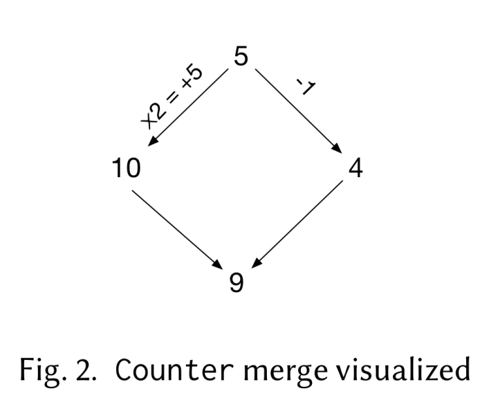
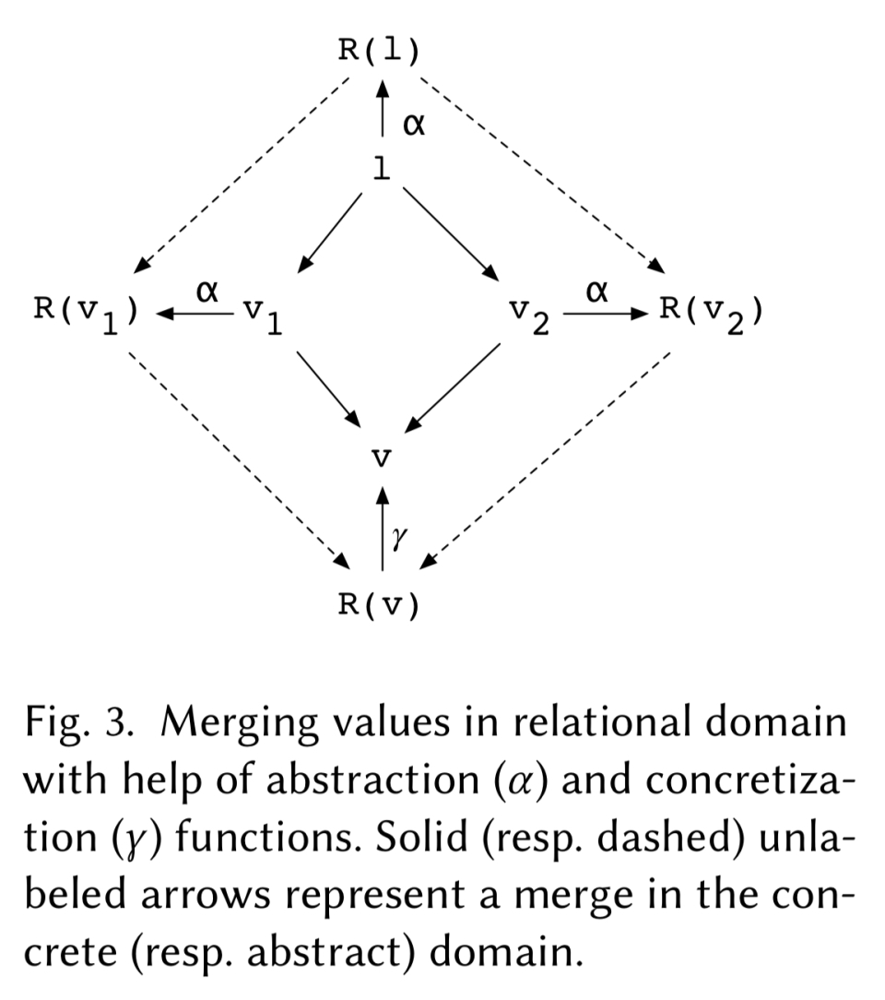
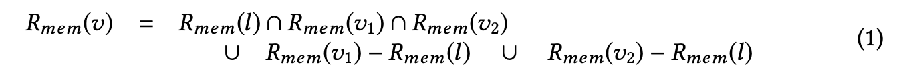
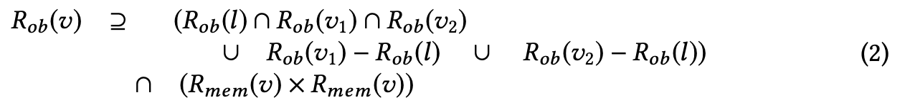
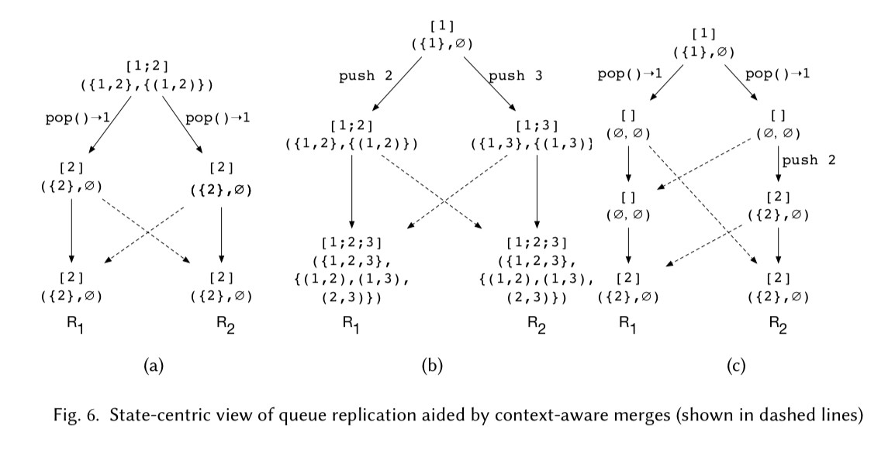
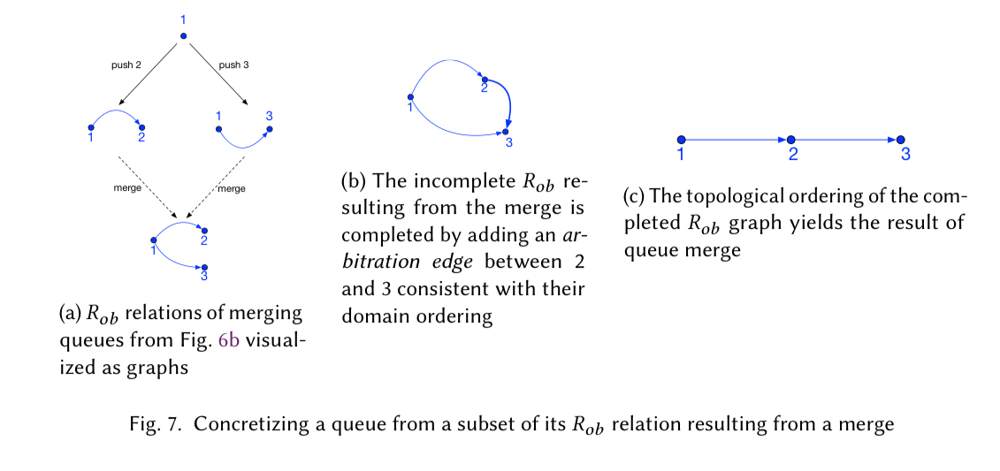
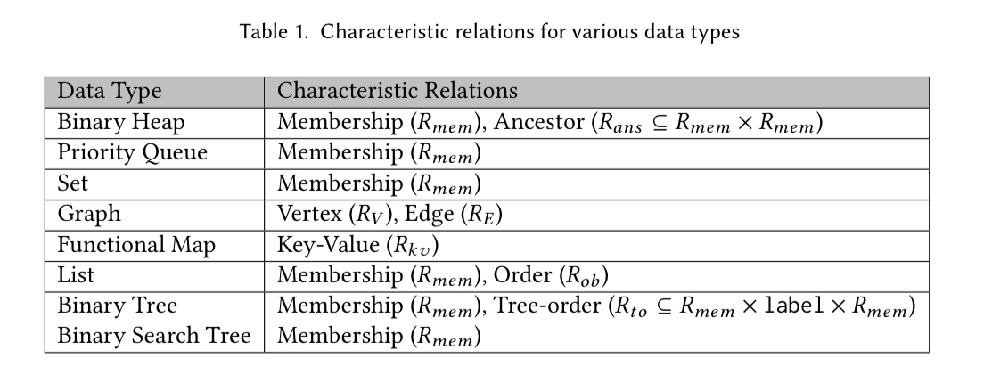

[Mergeable replicated data types](http://kcsrk.info/papers/oopsla19-mrdt.pdf) Kaki et al., OOPSLA’19

First, we need to know the context we need mergeable replicated data types(MRDT). In the introduction the authors mention:

> Modern distributed data-intensive applications often replicate data across geographically diverse locations to (a) enable trust decentralization, (b) guarantee low-latency access to application state, and (c) provide high availability even in the face of node and network failures.

To archive the target, and furthermore to have an automatic derivation of correct distributed(which means replicated) variants of ordinary data types. Their key approach was an invertible relational specification of an inductive data
type definition.

What they do was versioned states with explicit merges, basically is made by tracing the lowest common ancestor(LCA) version of merging versions.

Let's first look at a trivial example in the paper, counter:

```ocaml
module Counter : COUNTER =
struct
  type t = int
  let zero = 0
  let add x v = v + x
  let sub x v = v - x
  let mult x v = x * v
  let read v = v
end
```



If there has a initial state with integer `5`, and it has two child versions occured by `*2`(to make it more clear for non-cs people, this equal to `x2`) and `-1`. `*2` occurs version one `10`, `-1` occurs version two `4`. Now we merge version one and version two: merge `10` `4`, we can find the LCA of them are `5`, now let's define our merge function:

```ocaml
let merge lca v1 v2 = lca + ( v1 - lca ) + ( v2 - lca )
```

Notice that the result does not guarantee linearizability, for example with v1 occured by `*2` and v2 by `*3`.

The result is: `merge 5 10 15` which is `25`, not `5 * 2 * 3 = 30`, but it guarantees convergence.

Next we have a new thing: relational domain:



> The semantics of a merge in the relational set domain, albeit non-trivial, is nonetheless standard in the sense that it is independent of the concrete interpretations (in the data type domain) of the merging relations, and hence can be defined once and for all.

Queue example would show why we need relational domain.

Consider LCA of queue Q and two concurrent versions v1 and v2 to be merged. What should we do to guarantee convergence?

1. A queue element that was never popped in either version should still present in v.
2. For every element in Q, if it is popped in either v1 or v2 then it should not present in v. Note that `[2;2]` has two different elements, the same value didn't mean they are the same element.
3. If an element is not in Q and it is newly pushed into v1 or v2 then should in v.
4. Partial ordering is preserved: for every element e1 and e2 in Q(or v1, or v2) then if e1 and e2 are not deleted then e1 also occurs before e2 in v. With these, we can map queue state to relations using two relations: $$R_{mem}$$ is a set containing all the members of a queue, and $$R_{ob}$$ is an occurs-before relation relating every pair of elements e1 and e2 in the queue such that if e1 occurs before e2 in the queue, then $$(e1, e2) \in R_{ob}$$.

Now that we know how to map queues to the relational domain, we define the three-way merge operation in that domain as:



and



After merging states in the relational domain according to rules, we can make it back into the queue domain.



Functions that compute Rmem and Rob relations for a list. The syntax is stylized to aid comprehension:

```ocaml
let rec Rmem = function
  | [] -> ∅
  | x :: xs -> { x } ∪ Rmem ( xs )
let rec Rob = function
  | [] -> ∅
  | x :: xs -> ({ x } × Rmem ( xs ) ) ∪ Rob ( xs )
```

An implementation strategy of the queue state from relations $$R_{mem}$$ and $$R_{ob}$$ is constructing a directed graph with vertices $$R_{mem}(v)$$ and edges $$R_{ob}(v)$$, and ties broken with additional arbitration edges. A topological ordering of the graph then yields the queue.



> We have generalized the aforementioned graph-based approach for concretizing ordering relations and abstracted it away as a library function $$\gamma_{ord}$$. Give ord, an arbitration order the function $$\gamma_{ord}$$ concretizes an ordering relation of a data structure (not necessarily a total order) as a graph isomorphic to that structure, using the arbitration order to break ties…

Now we are getting closer to the general MRDT approach now. For each data type can define characteristic relations that define representation in the relational domain(like $$R_{mem}$$ and $$R_{ob}$$ in the queue), The following table shows the characteristic relations for a range of data types.



I haven't read whole content in MRDT, it seems like they are going to create atomically derive merge specification for an MRDT given the characteristic relations and the abstraction/concretization functions.

This is just a note, so I do not provide too many what I thought. And takes a lot word from paper XD.
