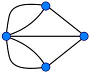

### Seven Bridges of Königsberg

The seven bridges of Königsberg is a notable problem in mathematics.
The following picture shows the actual layer of the seven bridges.

And we can use a graph version to simplify the problem.

[Euler](https://en.wikipedia.org/wiki/Leonhard_Euler) found, a walkthrough of a graph, traversing every edges exactly once,
depends on the [degrees](https://en.wikipedia.org/wiki/Degree_(graph_theory)) of the nodes(vertex).
The graph must be [connected](https://en.wikipedia.org/wiki/Connectivity_(graph_theory)) and have exactly zero or two nodes of odd degree.  
This walk called **Eulerian path** or **Euler walk** in his honor.   

### Eulerian circuit

Now we know what's Eulerian path. But what's **Eulerian circuit**?
**Eulerian circuit** is a Eulerian trail that can start from a node and end at the same node.
To make this, must have no nodes of odd degree in graph, because if there are nodes of odd degree,
then any Eulerian path will start at one of them and end at the other.

#### In Complete graph

A complete graph is a graph with each pair of graph vertices is connected by an edge.
The complete graph with $n$ graph vertices is denoted by $K_n$. Each vertex degree is $n-1$, therefore,
we can know when $n$ is an odd number, $K_n$ is an **Eulerian graph**.

#### In Complete bipartite graph

Complete bipartite graph, also calls complete bicolored graph or Complete bigraph.
It is a [bipartite graph](https://mathworld.wolfram.com/BipartiteGraph.html) such that every graph vertices in the two sets are adjacent.
If there are $p$ and $q$ graph vertices in the two sets, the complete bipartite graph is denoted $K_(p,q)$.
Since the vertices in set $p$ must connect every vertex in set $q$, vice in versa,
therefore, the only way to be a Eulerian graph is to make sure $p$ and $q$ both are even numbers.
